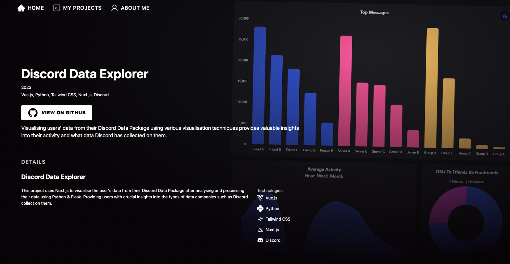
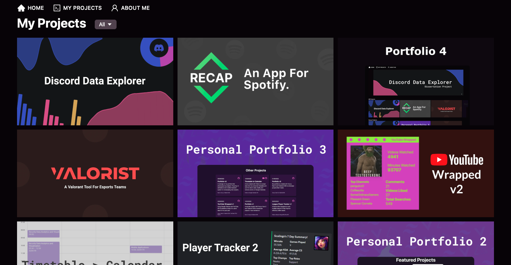

# Portfolio v4

[https://www.kayleewilliams.dev](https://www.kayleewilliams.dev)

A personal portfolio inspired by Disney+ that showcases my past projects and creations. Built using Next.js and Strapi.

## Getting Started

1. Clone the repo & navigate to the portfolio directory.
2. Install dependencies using npm: ```npm install```.
3. Run the development server: ```npm run dev```.

## Portfolio Examples

### Example Project Page



### Projects Page



